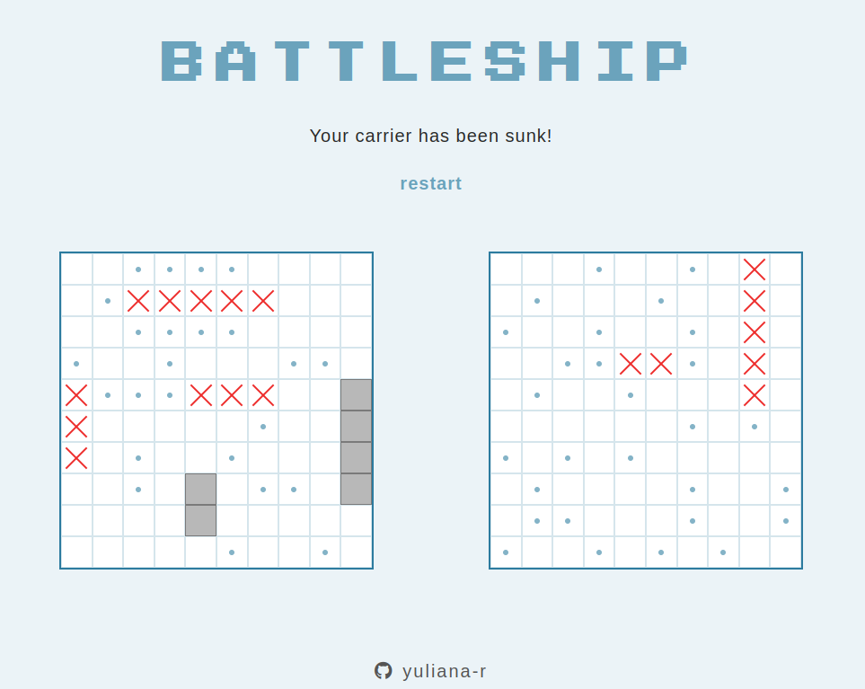

# Battleships
## Introduction 
This project is a game of Battleship that can be played in the browser against AI. It is built using the standard front-end stack of HTML, CSS, and JavaScript.

The project primarily demonstrates development of a web application with a test-driven development (TDD) approach, using Jest as the testing framework.

## Preview

## Media & assets credits:

1. Flaticon (Freepik): https://www.flaticon.com/free-icons/sword